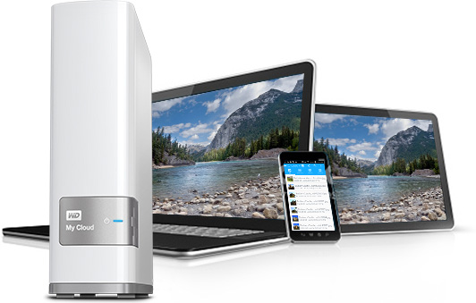

  <h2 style="border-bottom: none;"> Install Syncthing on a Raspberry Pi to create your own Dropbox. </h2>

 

### What is Syncthing?

**Syncthing** is an open source project that replaces proprietary sync and cloud services with something open, trustworthy and decentralized.
It is available on a lot of operating software which is very interesting for us.

You can learn more about it at <a href="http://syncthing.net">syncthing.net</a>

<!-- anchor -->

### 1. Set up your Raspberry Pi

<!-- anchor -->
@import "SetUpRaspberryPi.md";
<!-- anchor -->

### 2. Connect your Raspberry Pi to Wifi 

<!-- anchor -->
Tout d’abord, nous allons éditer le fichier _wpa_supplicant.conf_

`sudo nano /etc/wpa_supplicant/wpa_supplicant.conf`

Rendez-vous à la fin du fichier et ajoutez la définition de votre box en suivant ce template :
>network={
    ssid="Your box name"
    psk="The security key of your box"
    key_mgmt=WPA-PSK
}

Remplacez `"Your box name"` par le SSID de votre box internet et `"The security key of your box"` par le mot de passe de votre box.
>Si votre box utilise une clé de type WEP plutôt que du WPA/WPA2, insérez la valeur `NONE` dans `key_mgmt`, pour obtenir quelque chose de la forme `key_mgmt=NONE`.

Votre Raspberry Pi 3 est maintenant configuré pour se connecter à internet via sa puce Wi-Fi.
 Il ne vous reste plus qu’à démarrer le Wi-Fi de la Raspberry Pi avec cette commande :
`ifconfig wlan0`
##### Change the Raspberry Pi hostname :
Type the following command in a Terminal:
`sudo raspi-config`
to change the Raspberry Pi hostname on your network.

So you can access it on your network even if it has a dynamic IP address.

<!-- anchor -->

### 3. Secure your SSH connection 

<!-- anchor -->
##### Change the pi default password :
`sudo passwd pi`

This is one of the **most important** step.
If you don't change the default Raspberry Pi password, you let it open to hackers as the default user and password is known and hackers made some script to look for Raspberry Pi on the network with the default user and password.

######Create a new user :

Add it to the Sudo group

######Configure the SSH connection :

######Limit the SSH connection to your new user :
=======
##### Create a new user :

Add it to the Sudo group

##### Configure the SSH connection :

##### Limit the SSH connection to your new user :
>>>>>>> Stashed changes
We use sshd master configuration file to disable root login and this will may decrease and prevent the hacker from gaining root access to your Linux box. We also see how to enable root access again as well as how to limit ssh access based on users list.
Disable SSH Root Login
To disable root login, open the main ssh configuration file /etc/ssh/sshd_config with your choice of editor.

<<<<<<< Updated upstream
######Change the SSH default port : 
=======
##### Change the SSH default port : 
>>>>>>> Stashed changes
Limit SSH User Logins
If you have large number of user accounts on the systems, then it makes sense that we limit remote access to those users who really need it. Open the `/etc/ssh/sshd_config file`.
`sudo nano /etc/ssh/sshd_config`

Add an AllowUsers line at the bottom of the file with a space separated by list of usernames. For example, user tecmint and sheena both have access to remote ssh.

AllowUsers tecmint sheena

Change it from 22 (default for ssh) to a free one. 3321 should be ok.

Look for the line : 
What ports, IPs and protocols we listen for
Port 22

And Change Port 22 to Port 3321

Now to connect to your pi using ssh you have to specify the port :
`ssh yourname@yourRaspberryHostname -p yourNewSshPort` (3321 in the example).

If you have that error : 
>`Warning: the ECDSA host key for 'myserver' differs from the key for the IP address
that means that the ssh key in the known_hosts file changed (that’s indeed the case).`

So back up your ssh known_hosts file
`sudo cp ~/.ssh/known_hosts ~/.ssh/known_hosts.bak`

Then open the file and delete the former key :
`sudo nano ~/.ssh/known_hosts`

`ctrl-X then Y`

Then your ssh connection should be secure enough. 
##### Change the SSH default port :
<!-- anchor -->

### 4. Automount your NAS or Hard Disk Drive 

<!-- anchor -->
This works for any network storage or Hard Drive.

I personnaly have a WD MyCloud NAS. It is the simplest and cheapest NAS device from Western Digital. 

It is a very good device. But it doesn't have all the possibilities of more expensive NAS devices.
The Raspberry Pi is the perfect device to do bring a lot of excellent new features to it at the cheapest price.

##### 1. Configure the fstab file :
First, backup your fstab file if you mess something configuring it :
`sudo cp /etc/fstab /etc/fstab.bak`

##### 2. Create folder in the /mnt/ folder so that you can mount your network share in that folder
`sudo mkdir WDMyCloudShares`
`sudo nano /etc/fstab`

At the end of the file add the following lines :
>`//ShostaCloud/Remi/Vidéos/Films /home/remi/WDMyCloudShares/Videos cifs user=yourLogin,password=yourPassword,uid=remi,gid=remi,x-systemd.automount 0 0`
##### TODO: Add a screenshot with the fstab properly modified.

Reboot to verify that it works properly :
`sudo reboot`

Wait for the reboot, then check the mounted volumes :
`df -h`
<!-- anchor -->

### 5. Backup your Disk Image 

<!-- anchor -->
Now that you configured your Raspberry Pi, it is wise to backup your configuration in case something got wrong in the later configuration.
So you don't need to redo everything from the beginning.

##### 1. Shutdown your Raspberry Pi :

`sudo shutdown`

Get the SD Card out of the Pi and put it back to your Mac/Linux/Windows PC

##### 2. Backup the Raspberry Pi image to your computer : 

On Mac type : 
`sudo dd if=/dev/rdisk1 of=/path/to/backup.img bs=1m`

or to reduce the amount of space :
`sudo dd if=/dev/rdisk1 bs=1m | gzip > /path/to/backup.gz`

Then put the SD Card back in the Raspberry Pi and plug it back on.

Your backuped image file is now safe on your computer.
If you want to get back to it, you only have to burn that image to a microSD card with Etcher, following the step 1.
Or you can use the `dd` command and just swap the `if` (input file), and `of` (output file) parameters:
`sudo dd if=/path/to/backup.img of=/dev/rdisk1 bs=1m`
<!-- anchor -->

### 6. Install Synchting 

<!-- anchor -->
@import "InstallSyncthing.md" 
<!-- anchor -->

### 7. Configure Syncthing

<!-- anchor -->

<!-- anchor -->

   
Released under the <a href="LICENSE.md">Rémi Lavedrine License</a> 
Copyright © 2017 Rémi Lavedrine 
:man_technologist:  with  :heart:  in Paris :fr:

